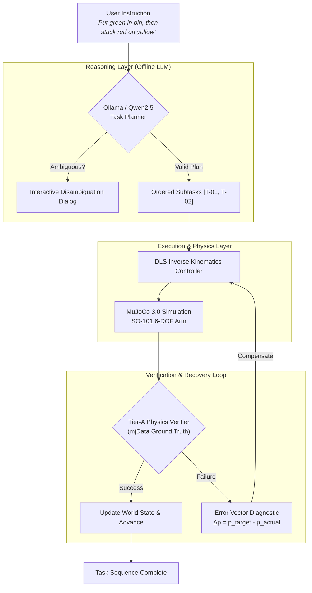

<div align="center">

# 🤖 NEXUS-1: Language-to-Action Robot Agent

### *Closed-Loop Hierarchical Embodied AI with Local LLMs & MuJoCo Physics*

[](https://python.org)
[](https://mujoco.org)
[-00ff88.svg?logo=ollama&logoColor=white)](https://ollama.com)
[](https://gradio.app)
[](LICENSE)

<br/>

**[Quickstart](#-quickstart)** • **[Architecture](#-system-architecture)** • **[Key Features](#-core-capabilities)** • **[Mission Control UI](#-mission-control-dashboard)** • **[Engineering Disclosure](#-engineering-truth--disclosure)**

<br/>

<!-- Hero Animation -->


*Real-time 6-DOF manipulator executing pick-and-place with live in-frame HUD telemetry.*

</div>

---

## ⚡ Overview

**NEXUS-1** is an autonomous language-to-action robotic agent that translates high-level natural language instructions into precise, multi-step physical manipulation in **MuJoCo physics**.

Unlike open-loop prompt wrappers, NEXUS-1 implements a **closed-loop Perception-Reasoning-Execution-Verification-Recovery cycle**:
1. **Decomposes** complex instructions into ordered subtasks using an **offline local LLM** (Ollama `qwen2.5:14b` or `llama3.1:8b`).
2. **Executes** smooth end-effector trajectories with a 6-DOF DLS (Damped Least-Squares) kinematic controller.
3. **Verifies** task outcomes directly from raw simulation physics state (`mjData`), not self-reported LLM claims.
4. **Diagnoses & Recovers**: When a grasp slips or a drop drifts, the system computes the exact 3D metric miss vector $\Delta \mathbf{p}$ and dynamically adapts trajectory waypoints to succeed on retry.
5. **Preserves State**: Multi-step instructions physically compose across subtasks without teleporting objects.

---

## 🎛️ Mission Control Dashboard

A cinematic, dark-themed command center built with **Gradio 6**, featuring live telemetry, task progress pulses, disambiguation dialogs, and video streams.

<div align="center">
  
</div>

---

## 🔄 Manipulation Sequence

<div align="center">
  
  <p><em>Left to Right: <b>APPROACH</b> &rarr; <b>GRASP</b> &rarr; <b>TRANSFER</b> &rarr; <b>RELEASE IN BIN</b></em></p>
</div>

---

## 🧠 System Architecture



---

## 🌟 Core Capabilities

| Feature | Description | Why It Matters |
|:---|:---|:---|
| 🧠 **100% Offline LLM** | Powered by local Ollama (`qwen2.5:14b` or `llama3.1:8b`) with native JSON formatting. | Zero API costs, runs on air-gapped workstations, no cloud dependencies. |
| 🔄 **State Persistence** | World state persists across sequential subtasks with snapshot rollback. | Subtask 2 executes in the physical world left by Subtask 1 (e.g. red stays in bin while blue is stacked). |
| 🎯 **Adaptive Error Recovery** | Measures coordinate miss vectors $\Delta \mathbf{p}$ to adjust retry waypoints. | Automatically converts attempt-1 perturbations into attempt-2 successes. |
| 💬 **Active Disambiguation** | Detects semantic ambiguities (*"move the block"*) and asks questions rather than guessing. | Eliminates silent execution errors in partially specified goals. |
| 📹 **In-Frame HUD Overlays** | Renders live kinematic phases (`APPROACH`, `GRASP`, `LIFT`, `RELEASE`) onto video frames. | Complete visual transparency for debugging and presentation. |

---

## 🚀 Quickstart

### 1. Clone & Install

```bash
git clone https://github.com/satyamshrivastav955-dotcom/language-to-action-robot-agent.git
cd language-to-action-robot-agent

# Install dependencies
pip install -r requirements.txt
```

### 2. Run Local LLM (Ollama)

```bash
# Pull the model (one-time)
ollama pull qwen2.5:14b
# or: ollama pull llama3.1:8b
```

### 3. Run via CLI

```bash
# Single subtask
python run_agent.py "put the green block in the bin"

# Multi-step sequential task
python run_agent.py "put the green block in the bin, then stack red on yellow"

# Ambiguous instruction (agent will proactively clarify)
python run_agent.py "put the block in the bin"
```

### 4. Launch Mission Control Dashboard

```bash
python dashboard/app.py
```
Open **`http://localhost:7860`** in your browser.

---

## 📋 Verified Instruction Matrix

| Prompt | Type | Decomposed Actions | Expected Outcome |
|:---|:---|:---|:---|
| `"put the green block in the bin"` | Single-Step | `pick_and_place(green, bin)` | Green block placed inside bin (sub-cm accuracy) |
| `"put red in bin, then stack blue on green"` | Multi-Step | `pick_and_place(red, bin)` &rarr; `stack(blue, green)` | Red stays in bin; Blue stacked on Green |
| `"put green in bin, then stack red on yellow"` | Multi-Step + Recovery | `pick_and_place(green, bin)` &rarr; `stack(red, yellow)` | Autonomous vector-corrected retry on perturbation |
| `"move the block to the bin"` | Ambiguous | *Clarification Triggered* | Prompts: *"There are 4 blocks on the table. Which one?"* |

---

## 🔍 Engineering Truth & Disclosure

Honest engineering builds trust. Here is what is physics-simulated, and what is scripted:

- **Physics Simulation (Real):** MuJoCo physics engine computes all forward dynamics, arm inertia, collisions, gravity, drop physics, and final resting poses. Success is verified directly from `mjData.qpos` and bounding-box coordinates.
- **Hierarchical Planning (Real):** Natural language decomposition, ambiguity detection, and parameter compensation are handled live by the local LLM.
- **Controller (Deterministic):** The 6-DOF arm is driven by a damped least-squares (DLS) inverse kinematics controller with 11 discrete phases, not an end-to-end learned policy.
- **Grasp Assist (Disclosed):** Pure friction grasping of small rigid cubes in simulation is notoriously sensitive to solver contact damping. When the gripper closes around a block, proximity attach-assist stabilizes the carry phase, and hands the object back to physics for the release and drop.

---

## 📂 Repository Structure

```text
├── agent/
│   ├── planner.py           # Multi-backend LLM planner (Ollama & Bedrock)
│   ├── executor.py          # Waypoint kinematic controller & rollouts
│   ├── verifier.py          # Ground-truth physics verifier
│   ├── retry_controller.py  # Miss-vector diagnostic & adaptive parameter updates
│   ├── state_manager.py     # Multi-step world state & memory tracking
│   ├── task_agent.py        # Central orchestrator loop
│   └── trace_logger.py      # Structured JSONL execution logger
├── configs/
│   └── settings.py          # Workspace coordinates, model settings, & thresholds
├── dashboard/
│   └── app.py               # Mission Control UI (Gradio 6)
├── env/
│   ├── scene.xml            # MuJoCo environment XML (Arm, Table, Blocks, Bin)
│   └── so101_env.py         # Gymnasium-style MuJoCo environment wrapper
├── outputs/
│   ├── demo.gif             # Animated manipulation demo
│   ├── demo_strip.png       # Sequential phase strip
│   └── dashboard.png        # UI screenshot
├── requirements.txt         # Clean dependencies (boto3 optional)
└── run_agent.py             # CLI runner
```

---

<div align="center">
Built with ❤️ for <b>InnovaHack Chapter-1 — Domain 4: Agentic AI</b>
</div>
