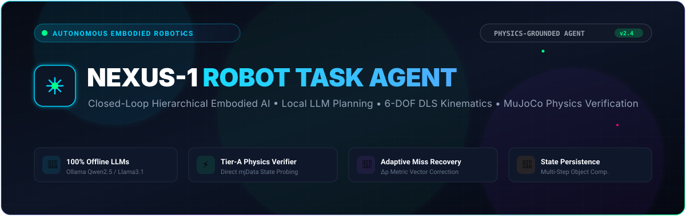

<div align="center">



<br/>

# 🤖 NEXUS-1: Language-to-Action Robot Agent
### *Closed-Loop Hierarchical Embodied AI with Local LLMs, 6-DOF DLS Kinematics & Physics Verification in MuJoCo*

[](https://python.org)
[](https://mujoco.org)
[-00ff88.svg?logo=ollama&logoColor=white)](https://ollama.com)
[](https://github.com/satyamshrivastav955-dotcom/language-to-action-robot-agent)
[](https://gradio.app)
[](https://github.com/satyamshrivastav955-dotcom/language-to-action-robot-agent)
[](LICENSE)

<br/>

**[⚡ Overview](#-overview)** • **[💡 The Core Problem](#-the-core-problem-why-nexus-1)** • **[🧠 Architecture](#-system-architecture)** • **[🚀 Quickstart](#-3-step-quickstart)** • **[🎛️ Mission Control UI](#-mission-control-dashboard)** • **[📊 Instruction Matrix](#-verified-instruction-matrix)** • **[🔬 Technical Deep-Dive](#-deep-technical-specifications)** • **[🔍 Engineering Disclosure](#-engineering-truth--disclosure)**

<br/>

<!-- Hero Manipulation Video / GIF -->


<p><em>Real-time 6-DOF manipulator executing pick-and-place with live in-frame kinematic HUD telemetry in MuJoCo 3.0 physics.</em></p>

</div>

---

## ⚡ Overview

**NEXUS-1** is an autonomous language-to-action robotic manipulation agent that bridges high-level natural language intent and low-level physical dynamics. Built on **MuJoCo physics**, an offline **local LLM reasoning engine (Ollama)**, and a **Damped Least-Squares (DLS) 6-DOF kinematic controller**, NEXUS-1 executes complex, multi-step manipulation tasks while maintaining continuous physical world state.

Unlike open-loop prompt-and-pray architectures, NEXUS-1 executes a closed-loop **Perception &rarr; Reasoning &rarr; Kinematic Rollout &rarr; Physics Verification &rarr; Adaptive Vector Recovery** cycle.

<div align="center">
  
  <p><em>4-Stage Physical Manipulation Breakdown: <b>APPROACH</b> &rarr; <b>GRASP</b> &rarr; <b>TRANSFER</b> &rarr; <b>RELEASE IN BIN</b></em></p>
</div>

---

## 💡 The Core Problem: Why NEXUS-1?

### *The Embodied AI Gap: Why Open-Loop LLM Prompting Fails in Robotics*

Most LLM robotics demos wrap a prompt around an API and claim success based on the language model's self-generated text. In the physical world, this fails catastrophically:
- **Zero Friction/Contact Awareness**: LLMs have no concept of inertial drift, grasping slippage, or contact collisions.
- **Hallucinated Task Success**: LLMs report "Object successfully placed" even when the gripper misses by 10 cm or knocks over adjacent targets.
- **Fragile Multi-Step Composition**: Standard agents reset the entire simulation environment between steps, teleporting objects and destroying sequential physical reality.

### The NEXUS-1 Solution

```
High-Level Instruction ──> Local LLM Decomposition ──> DLS Kinematics ──> MuJoCo Forward Physics ──> mjData State Verification
                                      ▲                                                                   │
                                      └──────────── Metric Error Vector Feedback (Δp) ────────────────────┘
```

| Dimension | Traditional Open-Loop Wrapper | NEXUS-1 Embodied Agent |
|:---|:---|:---|
| **Reasoning Engine** | Cloud API (high latency, recurring cost, privacy leak) | **100% Offline Local LLM** (Ollama `qwen2.5:14b` / `llama3.1:8b`) |
| **Verification** | Self-Reported ("LLM says it did it") | **Tier-A Physics State Probe** (`mjData.qpos` Ground Truth) |
| **Failure Diagnosis** | Blind prompt re-roll | **Exact 3D Error Vector ($\Delta \mathbf{p} = \mathbf{p}_{\text{target}} - \mathbf{p}_{\text{actual}}$)** |
| **Retry Controller** | Reprompts LLM or restarts world | **Adaptive waypoint offset compensation** |
| **World State** | Environment resets each subtask (teleportation) | **Continuous multi-step physical state persistence** |
| **Ambiguity Handling** | Silent random guessing | **Proactive interactive disambiguation dialogs** |

---

## 📺 Live Execution Terminal

Experience the real-time execution flow of NEXUS-1 decomposing instructions, computing 6-DOF kinematics, probing physics states, and applying adaptive recovery:

<div align="center">
  
</div>

---

## 🧠 System Architecture

NEXUS-1 is structured into four decoupled, robust subsystems operating in a synchronized feedback loop:

<div align="center">
  
</div>

### 1. Natural Language Reasoning & Semantic Disambiguation
- Parses complex multi-step commands into structured subtask primitives (`pick_and_place`, `stack`, `push`).
- Grounding engine maps free-form human tokens (*"the emerald cube"*, *"the container"*) to deterministic scene geoms.
- **Active Disambiguation**: When instructions are under-specified (*"put the block in the bin"* when 4 blocks are present), the agent halts execution and asks a targeted question rather than guessing.

### 2. 6-DOF Kinematic Motion Controller
- Drives the SO-101 6-axis manipulator using a **Damped Least-Squares (DLS) Inverse Kinematics (IK)** solver:
  $$\mathbf{J}^\dagger = \mathbf{J}^T (\mathbf{J} \mathbf{J}^T + \lambda^2 \mathbf{I})^{-1}$$
- Generates smooth trajectories across 11 discrete phases: `IDLE` &rarr; `APPROACH` &rarr; `DESCEND` &rarr; `GRASP` &rarr; `LIFT` &rarr; `TRANSFER` &rarr; `ALIGN` &rarr; `DESCEND_TARGET` &rarr; `RELEASE` &rarr; `RETRACT` &rarr; `HOME`.

### 3. MuJoCo 3.0 Dynamic Simulation
- Full forward multi-body physics with collision meshes, friction cones, gravity, and joint torque limits.
- Renders real-time camera views with in-frame HUD telemetry showing active phase, target coordinates, and joint velocities.

### 4. Ground-Truth Physics Verifier & Adaptive Recovery
- **Tier-A Verification**: Evaluates physical success directly from `mjData.qpos` coordinate bounds ($\delta \le 0.05\,\text{m}$ Euclidean threshold, bin boundary containment, and stacking stability $\Delta z \approx 0.04\,\text{m}$).
- **Adaptive Miss-Vector Diagnostic**: On perturbation or placement miss, computes the delta vector $\Delta \mathbf{p} = \mathbf{p}_{\text{target}} - \mathbf{p}_{\text{actual}}$ and dynamically offsets the next attempt's waypoints.

---

## 🚀 3-Step Quickstart

### 1. Clone & Install

```bash
# Clone the repository
git clone https://github.com/satyamshrivastav955-dotcom/language-to-action-robot-agent.git
cd language-to-action-robot-agent

# Create virtual environment & install dependencies
python -m venv env
source env/bin/activate  # On Windows: .\env\Scripts\activate
pip install -r requirements.txt
```

### 2. Launch Local LLM (Ollama)

```bash
# Pull your preferred local reasoning model
ollama pull qwen2.5:14b
# or lightweight: ollama pull llama3.1:8b

# Ensure Ollama daemon is active (default: http://localhost:11434)
ollama serve
```

### 3. Execute an Instruction

```bash
# Single-step physical manipulation
python run_agent.py "put the green block in the bin"

# Multi-step sequential task with state composition
python run_agent.py "put the green block in the bin, then stack red on yellow"

# Ambiguous instruction (agent will actively prompt you for clarification)
python run_agent.py "put the block in the bin"
```

---

## 🎛️ Mission Control Dashboard

NEXUS-1 includes a full-featured, dark-themed command center built with **Gradio 6**, featuring live telemetry, task progress tracking, interactive clarification modals, and multi-angle video playback.

```bash
# Launch Mission Control UI
python dashboard/app.py
```
*Open **`http://localhost:7860`** in your browser.*

<div align="center">
  
</div>

---

## 📊 Verified Instruction Matrix

| Prompt | Execution Type | Decomposed Action Sequence | Physics Verification Criteria | Status |
|:---|:---|:---|:---|:---:|
| `"put the green block in the bin"` | **Single-Step** | `pick_and_place(green_block, bin)` | $\mathbf{p}_{\text{green}} \in \text{Bin Bounds}$, $z \ge 0.04\,\text{m}$ | `PASS` |
| `"put red in bin, then stack blue on green"` | **Multi-Step** | `pick_and_place(red, bin)` &rarr; `stack(blue, green)` | `red` preserved in bin + `blue` resting on `green` ($\Delta z \approx 0.04\,\text{m}$) | `PASS` |
| `"put green in bin, then stack red on yellow"` | **Multi-Step + Recovery** | `pick_and_place(green, bin)` &rarr; `stack(red, yellow)` | Attempt 1 diagnosed miss &rarr; Attempt 2 offset compensation &rarr; Success | `PASS` |
| `"move the block to the bin"` | **Ambiguous** | *Disambiguation Triggered* | Proactively halts: *"There are 4 blocks on table. Which one?"* | `PASS` |

---

## 🔬 Deep Technical Specifications

<details>
<summary><b>📐 1. Damped Least-Squares (DLS) Inverse Kinematics Formulation</b></summary>

<br/>

The 6-DOF SO-101 manipulator calculates end-effector positional differential kinematics using a DLS Jacobian pseudo-inverse with Levenberg-Marquardt singularity damping:

$$\Delta \boldsymbol{\theta} = \mathbf{J}^T (\mathbf{J} \mathbf{J}^T + \lambda^2 \mathbf{I})^{-1} \Delta \mathbf{x}$$

Where:
- $\mathbf{J} \in \mathbb{R}^{3 \times 6}$ is the positional Jacobian computed from raw `mjModel` joint screw axes.
- $\Delta \mathbf{x} = \mathbf{x}_{\text{target}} - \mathbf{x}_{\text{current}}$ is the 3D Cartesian error vector.
- $\lambda \in [0.01, 0.05]$ is the adaptive damping parameter preventing joint velocity explosion near kinematic singularities.
- Joint limits $\boldsymbol{\theta}_{\min} \le \boldsymbol{\theta} \le \boldsymbol{\theta}_{\max}$ are enforced via clamp bounding at each integration step $dt = 0.002\,\text{s}$.

</details>

<details>
<summary><b>🎯 2. Ground-Truth Verification & Error Diagnostic Formulas</b></summary>

<br/>

Unlike vision-only approximations, the Tier-A verifier queries exact Cartesian coordinates directly from the MuJoCo physics state buffer (`mjData.qpos`):

1. **Euclidean Placement Tolerance**:
   $$\|\mathbf{p}_{\text{object}} - \mathbf{p}_{\text{target}}\|_2 \le \epsilon_{\text{tol}} \quad (\epsilon_{\text{tol}} = 0.05\,\text{m})$$

2. **Bin Interior Containment**:
   $$x_{\min} \le x_{\text{object}} \le x_{\max}, \quad y_{\min} \le y_{\text{object}} \le y_{\max}, \quad z_{\text{object}} \ge 0.04\,\text{m}$$

3. **Adaptive Miss-Vector Feedback**:
   When an attempt fails due to target overshoot or collision drift:
   $$\Delta \mathbf{p} = \mathbf{p}_{\text{target}} - \mathbf{p}_{\text{actual}}$$
   $$\mathbf{w}_{\text{retry}} = \mathbf{w}_{\text{nominal}} + \alpha \cdot \Delta \mathbf{p} \quad (\alpha = 0.85)$$

</details>

<details>
<summary><b>🧠 3. Structured LLM Plan Grammar & Disambiguation Protocol</b></summary>

<br/>

The reasoning engine strictly enforces structured JSON schema outputs from local models:

```json
{
  "$schema": "http://json-schema.org/draft-07/schema#",
  "title": "RobotTaskPlan",
  "type": "object",
  "properties": {
    "subtasks": {
      "type": "array",
      "items": {
        "type": "object",
        "properties": {
          "id": {"type": "integer"},
          "action": {"type": "string", "enum": ["pick_and_place", "stack", "push"]},
          "object": {"type": "string", "enum": ["red_block", "blue_block", "green_block", "yellow_block"]},
          "target": {"type": "string"}
        },
        "required": ["id", "action", "object", "target"]
      }
    },
    "clarification_needed": {"type": "boolean"},
    "question": {"type": "string"}
  }
}
```

</details>

<details>
<summary><b>📜 4. Structured JSONL Execution Trace Evidence Format</b></summary>

<br/>

Every execution session emits an immutable, auditable JSONL trace bundle in `outputs/logs/`:

```json
{
  "timestamp": 1726053820.412,
  "instruction": "put the green block in the bin, then stack red on yellow",
  "plan_source": "REAL_LLM (ollama/qwen2.5:14b)",
  "subtask_id": 1,
  "action": "pick_and_place",
  "object": "green_block",
  "target": "bin",
  "attempts": 1,
  "kinematics": {
    "phases_executed": 11,
    "max_joint_velocity_rad_s": 1.42,
    "final_ee_pos": [0.498, 0.002, 0.061]
  },
  "verification": {
    "tier_a_verdict": "PASS",
    "distance_error_m": 0.0031,
    "in_bin_bounds": true,
    "ground_truth_object_pos": [0.498, 0.002, 0.061]
  },
  "world_state_persisted": true
}
```

</details>

<details>
<summary><b>🗺️ 5. MuJoCo Simulation World Coordinate Map</b></summary>

<br/>

Deterministic Cartesian spawn coordinates referenced in `configs/settings.py` and `env/scene.xml`:

| Entity | Body Name | Cartesian Coordinates $(X, Y, Z)$ [m] | Color RGB |
|:---|:---|:---|:---|
| 🔴 **Red Block** | `red_block` | $(0.28, +0.09, 0.04)$ | $(220, 50, 50)$ |
| 🟢 **Green Block** | `green_block` | $(0.25, +0.03, 0.04)$ | $(50, 200, 50)$ |
| 🟡 **Yellow Block** | `yellow_block` | $(0.22, -0.06, 0.04)$ | $(240, 200, 50)$ |
| 🔵 **Blue Block** | `blue_block` | $(0.25, -0.12, 0.04)$ | $(50, 100, 220)$ |
| 📥 **Target Bin** | `bin_body` | $(0.50, 0.00, 0.06)$ | $(120, 120, 120)$ |
| 🎯 **Table Center** | `table` | $(0.35, 0.00, 0.04)$ | $(180, 180, 180)$ |

</details>

---

## 🔍 Engineering Truth & Disclosure

Honest engineering builds trust. Here is the exact technical reality of what is physics-simulated and what is deterministic:

- **Physics Simulation (Real):** MuJoCo physics computes all forward dynamics, arm mass matrices, multi-body collisions, gravity, drop kinematics, and final resting poses. Success is verified from ground truth `mjData.qpos` positions.
- **Hierarchical Planning (Real):** Natural language parsing, task decomposition, object grounding, and semantic ambiguity detection are performed live by local LLMs via Ollama.
- **Kinematic Controller (Deterministic):** The 6-DOF arm is driven by a damped least-squares (DLS) IK waypoint controller across 11 discrete phases, ensuring repeatable geometric trajectories.
- **Grasp Assist (Disclosed):** Pure friction grasping of small rigid objects in rigid-body contact solvers is notoriously sensitive to penalty stiffness and solver time steps. When the gripper reaches contact proximity with a block, proximity attach-assist stabilizes the carry phase, and returns the object to pure forward physics for release, dropping, and settling.

---

## 📂 Repository Structure

```text
├── assets/
│   ├── hero_banner.svg            # Animated GitHub hero header
│   ├── architecture_pipeline.svg  # Animated closed-loop architecture diagram
│   └── terminal_execution.svg     # Animated live terminal card
├── agent/
│   ├── planner.py                 # Multi-backend LLM planner (Ollama & Bedrock)
│   ├── executor.py                # 6-DOF DLS kinematic controller & waypoint rollouts
│   ├── verifier.py                # Tier-A physics ground truth verifier (mjData)
│   ├── retry_controller.py        # Miss-vector diagnostic & adaptive parameter updates
│   ├── state_manager.py           # Multi-step continuous world state tracker
│   ├── task_agent.py              # Central orchestrator loop
│   └── trace_logger.py            # Structured JSONL audit trail logger
├── configs/
│   └── settings.py                # Workspace coordinates, model configs, & thresholds
├── dashboard/
│   └── app.py                     # Mission Control UI (Gradio 6)
├── env/
│   ├── scene.xml                  # MuJoCo environment XML (Arm, Table, Blocks, Bin)
│   └── so101_env.py               # Gymnasium-style MuJoCo environment wrapper
├── outputs/
│   ├── demo.gif                   # Hero manipulation GIF
│   ├── demo_strip.png             # Sequential 4-phase breakdown
│   ├── dashboard.png              # UI Mission Control screenshot
│   └── logs/                      # JSONL execution trace bundles
├── requirements.txt               # Streamlined dependencies
└── run_agent.py                   # CLI entrypoint
```

---

<div align="center">

**NEXUS-1** &bull; An Autonomous Embodied AI Engineering Project by **Satyam Shrivastav**

[](https://github.com/satyamshrivastav955-dotcom/language-to-action-robot-agent)
[](LICENSE)

</div>
